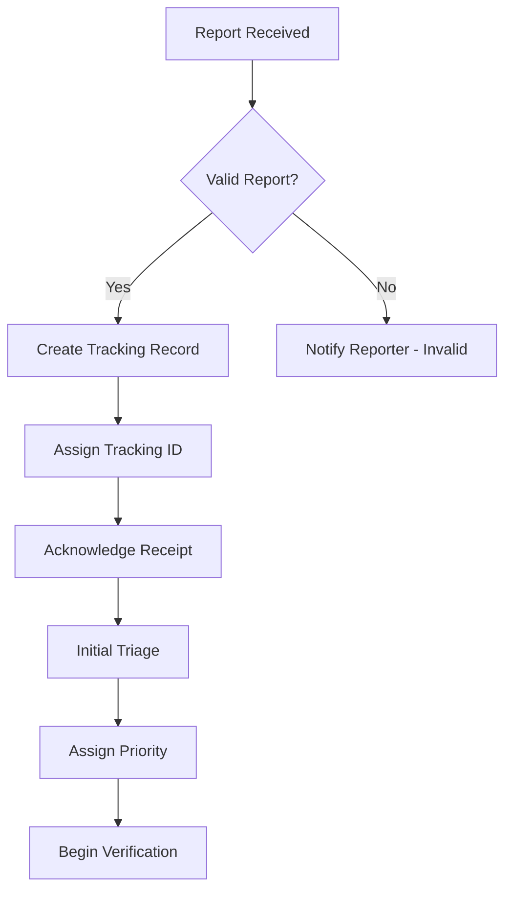

# Vulnerability Tracking System

## Overview

This document describes the vulnerability tracking system used by StellarSwipe to manage security vulnerability reports from discovery through remediation and disclosure.

---

## Table of Contents

1. [Tracking System Architecture](#tracking-system-architecture)
2. [Vulnerability Lifecycle](#vulnerability-lifecycle)
3. [Tracking Fields](#tracking-fields)
4. [Status Definitions](#status-definitions)
5. [Priority Levels](#priority-levels)
6. [Workflow Processes](#workflow-processes)
7. [Reporting and Metrics](#reporting-and-metrics)

---

## Tracking System Architecture

### System Components

**1. Issue Tracking**
- **Platform**: GitHub Security Advisories (Primary)
- **Backup**: Internal tracking system
- **Access**: Security team only (private)

**2. Communication Hub**
- **Email**: security@stellarswipe.io
- **Encrypted**: PGP/Keybase for sensitive data
- **Bug Bounty Platform**: [To be integrated]

**3. Documentation**
- **Reports**: Stored in secure repository
- **Patches**: Version controlled
- **Disclosure**: Public advisories post-fix

**4. Metrics Dashboard**
- **Response Times**: Track SLA compliance
- **Severity Distribution**: Vulnerability trends
- **Bounty Payments**: Financial tracking
- **Researcher Stats**: Contributor metrics

### Data Security

**Access Control:**
- Security team: Full access
- Core developers: Read access (sanitized)
- Researchers: Own reports only
- Public: Disclosed vulnerabilities only

**Data Retention:**
- Active reports: Indefinite
- Resolved reports: 5 years minimum
- Researcher data: Per privacy policy
- Audit logs: 7 years

---

## Vulnerability Lifecycle

### Lifecycle Stages

```
1. REPORTED → 2. TRIAGED → 3. VERIFIED → 4. IN_REMEDIATION → 
5. FIXED → 6. DEPLOYED → 7. DISCLOSED → 8. CLOSED
```

### Stage Details

#### 1. REPORTED
- **Trigger**: Vulnerability report received
- **Owner**: Security team
- **Actions**: 
  - Acknowledge receipt (48h SLA)
  - Assign tracking ID
  - Create tracking record
  - Initial classification

#### 2. TRIAGED
- **Trigger**: Initial review complete
- **Owner**: Security team lead
- **Actions**:
  - Assess severity
  - Determine scope
  - Assign priority
  - Allocate resources
  - Notify stakeholders

#### 3. VERIFIED
- **Trigger**: Vulnerability confirmed
- **Owner**: Security engineer
- **Actions**:
  - Reproduce issue
  - Analyze impact
  - Document attack vectors
  - Determine bounty eligibility
  - Notify researcher of status

#### 4. IN_REMEDIATION
- **Trigger**: Fix development started
- **Owner**: Development team
- **Actions**:
  - Design fix
  - Implement solution
  - Write tests
  - Internal review
  - Security review

#### 5. FIXED
- **Trigger**: Fix completed and tested
- **Owner**: QA team
- **Actions**:
  - Verify fix effectiveness
  - Regression testing
  - Performance testing
  - Prepare deployment
  - Update documentation

#### 6. DEPLOYED
- **Trigger**: Fix deployed to production
- **Owner**: DevOps team
- **Actions**:
  - Deploy to testnet
  - Monitor for issues
  - Deploy to mainnet
  - Verify in production
  - Monitor metrics

#### 7. DISCLOSED
- **Trigger**: Public disclosure date reached
- **Owner**: Security team
- **Actions**:
  - Coordinate with researcher
  - Prepare advisory
  - Publish disclosure
  - Update hall of fame
  - Process bounty payment

#### 8. CLOSED
- **Trigger**: All actions complete
- **Owner**: Security team
- **Actions**:
  - Final documentation
  - Archive report
  - Update metrics
  - Lessons learned
  - Process improvements

---

## Tracking Fields

### Core Fields

#### Identification
```yaml
vulnerability_id: VUL-2026-001
title: "Brief vulnerability description"
cve_id: CVE-2026-XXXXX (if applicable)
created_date: 2026-06-01
last_updated: 2026-06-15
```

#### Reporter Information
```yaml
reporter:
  name: "John Doe"
  handle: "security_researcher"
  email: "researcher@example.com"
  payment_address: "GXXXXXXXXXXXXXXXXXXXXXXXXXXXXXXXXXXXXXXXXXXXXXXX"
  anonymous: false
  hall_of_fame_consent: true
```

#### Classification
```yaml
severity: CRITICAL | HIGH | MEDIUM | LOW
category: 
  - Access Control
  - Reentrancy
  - Integer Overflow
  - Logic Error
  - etc.
cvss_score: 9.5
exploitability: HIGH | MEDIUM | LOW
impact: HIGH | MEDIUM | LOW
```

#### Affected Components
```yaml
affected_contracts:
  - name: "StakeVault"
    version: "1.2.0"
    commit: "abc123def456"
    functions:
      - "withdraw()"
      - "claim_rewards()"
affected_networks:
  - mainnet
  - testnet
```

#### Status Tracking
```yaml
status: IN_REMEDIATION
priority: P0 | P1 | P2 | P3
assigned_to: "security-team@stellarswipe.io"
due_date: 2026-06-30
estimated_fix_date: 2026-06-20
```

#### Timeline
```yaml
timeline:
  reported: 2026-06-01T10:00:00Z
  acknowledged: 2026-06-01T14:30:00Z
  triaged: 2026-06-02T09:00:00Z
  verified: 2026-06-03T16:00:00Z
  fix_started: 2026-06-04T10:00:00Z
  fix_completed: 2026-06-15T14:00:00Z
  deployed_testnet: 2026-06-18T10:00:00Z
  deployed_mainnet: 2026-06-20T15:00:00Z
  disclosed: 2026-08-01T12:00:00Z
  closed: 2026-08-05T10:00:00Z
```

#### Bounty Information
```yaml
bounty:
  eligible: true
  tier: CRITICAL
  amount_usd: 25000
  amount_xlm: 125000
  payment_status: PENDING | PAID
  payment_date: 2026-08-05
  payment_tx: "transaction_hash"
```

#### Technical Details
```yaml
technical:
  description: "Detailed technical description"
  attack_vector: "Step-by-step attack scenario"
  proof_of_concept: "PoC code or transaction"
  root_cause: "Underlying cause analysis"
  affected_users: 1500
  funds_at_risk: 1000000 XLM
```

#### Remediation
```yaml
remediation:
  fix_description: "Description of the fix"
  fix_commit: "def789ghi012"
  fix_pr: "#123"
  testing_notes: "Testing approach and results"
  deployment_notes: "Deployment considerations"
  rollback_plan: "Rollback procedure if needed"
```

#### Disclosure
```yaml
disclosure:
  public_disclosure_date: 2026-08-01
  advisory_url: "https://github.com/.../advisories/GHSA-XXXX"
  cve_published: true
  researcher_credited: true
  blog_post_url: "https://blog.stellarswipe.io/security-update"
```

---

## Status Definitions

### Active Statuses

**REPORTED**
- Initial report received
- Awaiting triage
- SLA: Acknowledge within 48 hours

**TRIAGED**
- Initial assessment complete
- Severity assigned
- Resources allocated
- SLA: Complete within 5 days of report

**VERIFIED**
- Vulnerability confirmed
- Impact assessed
- Bounty eligibility determined
- SLA: Complete within 7 days of report

**IN_REMEDIATION**
- Fix in development
- Regular updates to researcher
- SLA: Based on severity (5-30 days)

**FIXED**
- Fix completed and tested
- Awaiting deployment
- SLA: Deploy within 7 days

**DEPLOYED**
- Fix live in production
- Monitoring active
- Awaiting disclosure period

**DISCLOSED**
- Public disclosure published
- Researcher credited
- Bounty payment processed

### Terminal Statuses

**CLOSED**
- All actions complete
- Report archived
- Metrics updated

**DUPLICATE**
- Already reported by another researcher
- Original report referenced
- Reporter notified

**NOT_APPLICABLE**
- Not a security vulnerability
- Out of scope
- Explanation provided

**WONT_FIX**
- Accepted risk
- Mitigation documented
- Rationale provided

**INVALID**
- Cannot reproduce
- Insufficient information
- Not a valid vulnerability

---

## Priority Levels

### Priority Definitions

**P0 - Critical**
- **Severity**: Critical
- **Impact**: Immediate threat to user funds
- **Response**: Immediate (24/7)
- **Fix Timeline**: 5-7 days
- **Examples**: Active exploitation, fund theft possible

**P1 - High**
- **Severity**: High
- **Impact**: Significant security risk
- **Response**: Within 24 hours
- **Fix Timeline**: 7-14 days
- **Examples**: Privilege escalation, major logic errors

**P2 - Medium**
- **Severity**: Medium
- **Impact**: Moderate security risk
- **Response**: Within 48 hours
- **Fix Timeline**: 14-30 days
- **Examples**: Information disclosure, minor access control issues

**P3 - Low**
- **Severity**: Low
- **Impact**: Minimal security risk
- **Response**: Within 5 days
- **Fix Timeline**: 30-60 days
- **Examples**: Best practice violations, documentation errors

### Priority Escalation

Priorities may be escalated if:
- Active exploitation detected
- Public disclosure imminent
- Impact greater than initially assessed
- Multiple vulnerabilities combined
- Regulatory or compliance concerns

---

## Workflow Processes

### Report Intake Process



### Verification Process

1. **Reproduce Issue**
   - Set up test environment
   - Follow PoC steps
   - Document results

2. **Analyze Impact**
   - Assess affected users
   - Calculate funds at risk
   - Determine exploitability

3. **Confirm Severity**
   - Calculate CVSS score
   - Review with security team
   - Finalize classification

4. **Notify Researcher**
   - Confirm vulnerability
   - Communicate severity
   - Provide timeline
   - Discuss bounty

### Remediation Process

1. **Design Fix**
   - Analyze root cause
   - Design solution
   - Review with team
   - Consider side effects

2. **Implement Fix**
   - Write code
   - Add tests
   - Update documentation
   - Code review

3. **Security Review**
   - Review fix effectiveness
   - Check for regressions
   - Verify test coverage
   - Approve for deployment

4. **Deployment**
   - Deploy to testnet
   - Monitor and test
   - Deploy to mainnet
   - Verify fix

### Disclosure Process

1. **Coordinate Timeline**
   - Agree on disclosure date
   - Prepare materials
   - Review with researcher
   - Schedule publication

2. **Prepare Advisory**
   - Write technical details
   - Credit researcher
   - Provide mitigation steps
   - Review and approve

3. **Publish Disclosure**
   - Publish advisory
   - Update documentation
   - Notify community
   - Monitor response

4. **Post-Disclosure**
   - Process bounty payment
   - Update hall of fame
   - Archive report
   - Conduct retrospective

---

## Reporting and Metrics

### Key Metrics

**Response Metrics**
- Time to acknowledgment
- Time to triage
- Time to verification
- Time to fix
- Time to deployment
- Total resolution time

**Volume Metrics**
- Reports received (by period)
- Reports by severity
- Reports by category
- Duplicate rate
- Invalid report rate

**Quality Metrics**
- Bounties paid
- Average bounty amount
- Researcher satisfaction
- Fix effectiveness
- Regression rate

**Performance Metrics**
- SLA compliance rate
- Average resolution time by severity
- Backlog size
- Open vs. closed reports

### Reporting Cadence

**Daily**
- New reports
- Critical/High priority status
- SLA violations
- Escalations

**Weekly**
- All active reports
- Metrics dashboard
- Resource allocation
- Upcoming deadlines

**Monthly**
- Comprehensive metrics
- Trend analysis
- Bounty payments
- Hall of fame updates

**Quarterly**
- Executive summary
- Strategic review
- Process improvements
- Budget review

### Sample Metrics Dashboard

```
=== Vulnerability Tracking Dashboard ===
Period: June 2026

ACTIVE REPORTS
├── Critical: 1 (P0)
├── High: 3 (P1)
├── Medium: 5 (P2)
└── Low: 8 (P3)

RESPONSE TIMES (Average)
├── Acknowledgment: 18 hours (Target: 48h) ✓
├── Triage: 3.2 days (Target: 5d) ✓
├── Verification: 5.8 days (Target: 7d) ✓
└── Resolution: 22 days (Target: 30d) ✓

BOUNTIES
├── Paid This Month: $45,000
├── Pending: $25,000
├── Total YTD: $180,000
└── Researchers: 12

TRENDS
├── Reports: +15% vs last month
├── Critical: -50% vs last month ✓
├── Resolution Time: -10% vs last month ✓
└── Duplicate Rate: 12% (Target: <15%) ✓
```

---

## Integration with Development

### CI/CD Integration

**Automated Checks**
- Security test suite runs on all PRs
- Vulnerability regression tests
- Static analysis tools
- Dependency vulnerability scanning

**Deployment Gates**
- Security review required for fixes
- Test coverage requirements
- Performance impact assessment
- Rollback plan documented

### Version Control

**Branch Strategy**
- `security/VUL-XXXX` branches for fixes
- Protected branches require reviews
- Signed commits for security fixes
- Audit trail maintained

**Commit Messages**
```
security: Fix reentrancy in withdraw function

Addresses VUL-2026-001 (Critical)
- Add reentrancy guard
- Update state before external calls
- Add comprehensive tests

Bounty: $25,000 to @researcher
```

---

## Tools and Automation

### Recommended Tools

**Tracking**
- GitHub Security Advisories
- JIRA/Linear for internal tracking
- Bug bounty platform integration

**Communication**
- Email with PGP encryption
- Keybase for secure messaging
- Slack/Discord for team coordination

**Analysis**
- Soroban CLI for testing
- Static analysis tools
- Fuzzing frameworks
- Symbolic execution tools

**Monitoring**
- Contract monitoring services
- Transaction analysis
- Anomaly detection
- Alert systems

### Automation Opportunities

**Automated Workflows**
- Report acknowledgment emails
- Status update notifications
- SLA violation alerts
- Metrics generation
- Report templates

**Integration Points**
- Bug bounty platform webhooks
- GitHub Actions for security tests
- Monitoring alerts to tracking system
- Payment processing automation

---

## Continuous Improvement

### Retrospectives

After each major vulnerability:
1. **What Went Well**: Successes to repeat
2. **What Could Improve**: Areas for enhancement
3. **Action Items**: Specific improvements
4. **Process Updates**: Policy/procedure changes

### Process Evolution

**Regular Reviews**
- Quarterly policy review
- Annual comprehensive audit
- Researcher feedback incorporation
- Industry best practice updates

**Metrics-Driven Improvements**
- Identify bottlenecks
- Optimize workflows
- Improve response times
- Enhance researcher experience

---

## Appendix

### Tracking ID Format

```
VUL-YYYY-NNN
├── VUL: Vulnerability prefix
├── YYYY: Year
└── NNN: Sequential number (001-999)

Example: VUL-2026-042
```

### Severity Calculation

Based on CVSS v3.1:
- **Critical**: 9.0-10.0
- **High**: 7.0-8.9
- **Medium**: 4.0-6.9
- **Low**: 0.1-3.9

### Contact Information

**Security Team**
- Email: security@stellarswipe.io
- Emergency: emergency-security@stellarswipe.io
- PGP: See `docs/security/pgp-key.asc`

---

**Document Version**: 1.0.0  
**Last Updated**: 2026-06-01  
**Owner**: Security Team
